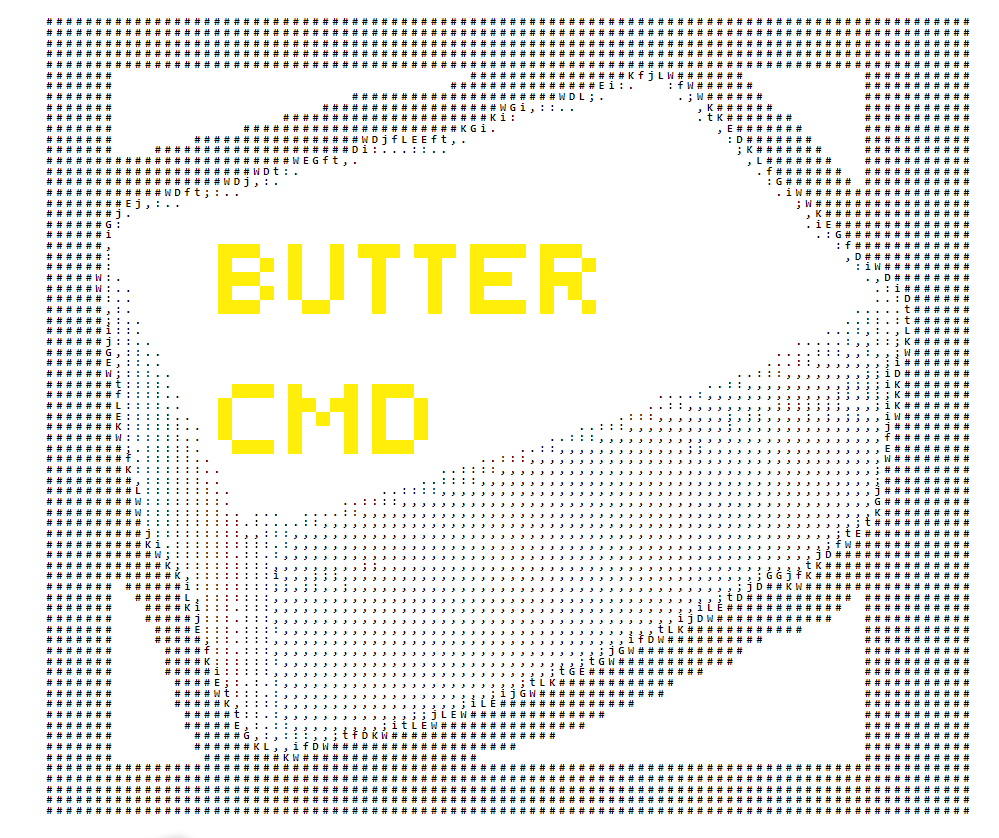
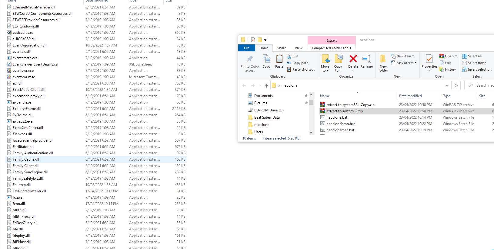
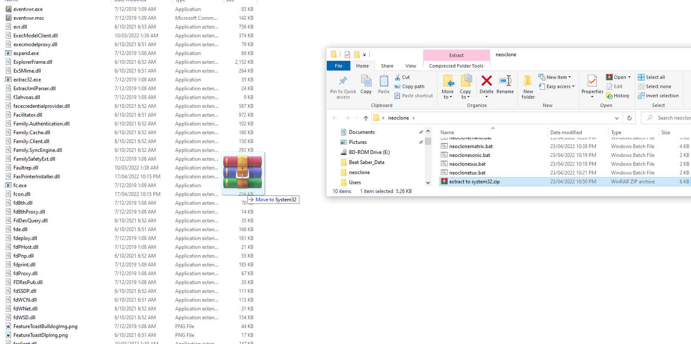
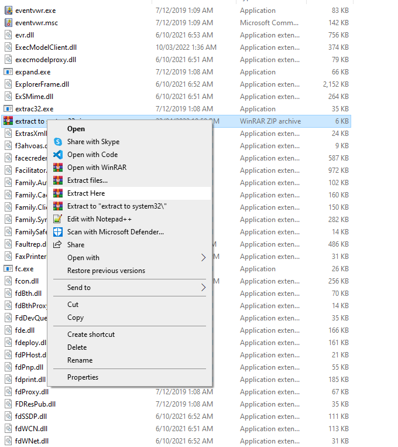

# butter Command Prompt!
A sleek Customised Windows Command Prompt
All made in batch!
________________________________________________________
# ** THIS IS NOT MEANT TO BE A REPLACEMENT FOR CMD **

a windows command prompt with all windows command prompt features + more
( mostly because it uses windows CMD lol )

you can check the wiki for a list of commands

__________________

# install guide 
___________________

# first open system32 

# second drag "export to system32.zip" to system32

# third right click "export to system32.zip" then click "extract here"

